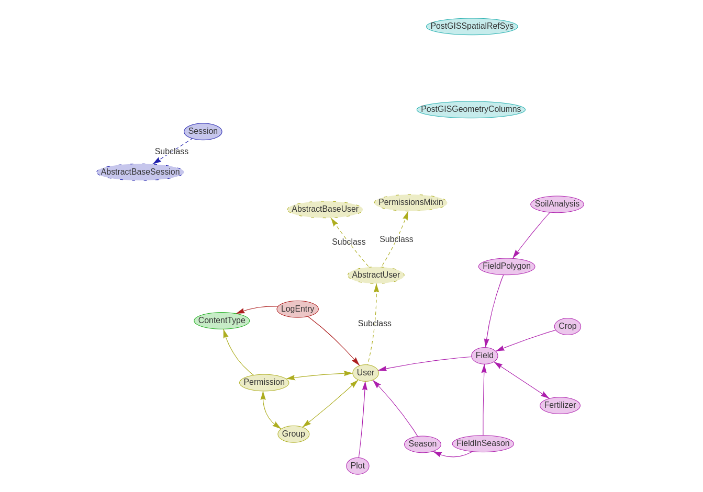

# Plot Service: It is the data storage of the farmer's plot.

#### The web backend is built using the Django framework, and manages mainly:

- the core data model: the models are defined in `**/models.py` files (see [Models](https://docs.djangoproject.com/en/4.0/topics/db/models/))
- the Administration Portal, built around the [Django Admin](https://docs.djangoproject.com/en/4.0/ref/contrib/admin/) framework.


## Architecture
#### The backend architecture as per ORM and caching can be summarized as follows:


### Data model (ORM)
Leverages Django ORM to manage the data model. Objects are created as Python classes that inherit from the Django's [Model](https://docs.djangoproject.com/en/3.2/ref/models/base/#model-inheritance) class, and define any number of fields required for the business logic. They are then mapped to the database using the [Django ORM](https://docs.djangoproject.com/en/3.2/topics/db/models/#model-api), through migrations. The migrations are defined in `**/migrations/` folders.

## Development setup
### Prerequisites

- Python 3.10
- Docker

### Environment variables

The web backend expects the following environment variables to be set:
- `POSTGRES_DB`
- `POSTGRES_PASSWORD`
- `POSTGRES_USER`
- `POSTGRES_HOST`
- `POSTGRES_PORT`
- `SECRET_KEY`
- `SCI_HUB_USERNAME`
- `SCI_HUB_PASSWORD`


### Setup

```
git clone -b main git@gitlab.com:gip-python/plot.git
```

```
docker-compose up -d --build
```

```
docker-compose exec web ./manage.py createsuperuser
```

## Tests
```

# Start unit test --------------------------------
sudo docker-compose exec web python manage.py test


# Start django test coverage ---------------------
sudo docker-compose exec web coverage report

```

## Indexes
Now we have opportunity to get 2 kind of index(NDVI, NDMI). 
You have to upload 4 satellite images in tiff format from Sentinel-2.
Ther are B04, B08, B8A, B11.
